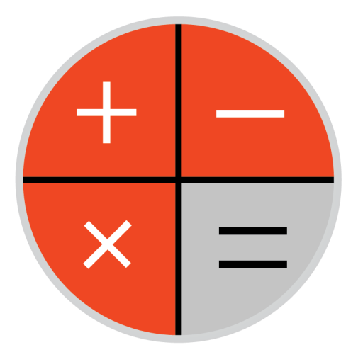

<div id="top"></div>
<!-- Best-README-Template ---------------------------------------------------------------------->
<!--
*** https://github.com/othneildrew/Best-README-Template
*** Thanks for checking out the Best-README-Template. If you have a suggestion
*** that would make this better, please fork the repo and create a pull request
*** or simply open an issue with the tag "enhancement".
*** Don't forget to give the project a star!
*** Thanks again! Now go create something AMAZING! :D
-->
<!-- ------------------------------------------------------------------------------------------->

<!-- PROJECT SHIELDS --------------------------------------------------------------------------->
<!--
*** I'm using markdown "reference style" links for readability.
*** Reference links are enclosed in brackets [ ] instead of parentheses ( ).
*** See the bottom of this document for the declaration of the reference variables
*** for contributors-url, forks-url, etc. This is an optional, concise syntax you may use.
*** https://www.markdownguide.org/basic-syntax/#reference-style-links
-->
[![Contributors][contributors-shield]][contributors-url]
[![Forks][forks-shield]][forks-url]
[![Stargazers][stars-shield]][stars-url]
[![Issues][issues-shield]][issues-url]
[![MIT License][license-shield]][license-url]
<!--
[![LinkedIn][linkedin-shield]][linkedin-url]
-->
<!-- ------------------------------------------------------------------------------------------->

<!-- PROJECT LOGO ------------------------------------------------------------------------------>
<div align="center">
  <a href="https://github.com/MER-GROUP/KivyCalc">
    
  </a>

  <h1 align="center"><b>Kivi Calc</b></h1>

  <p align="center">
        <h2><b>KivyCalc is a simple cross-platform calculator</b><br />
            <i>[KivyCalc - это простой кроссплатформенный калькулятор]</i></h2>
        <h3><b>Screenshots of the program in Linux, MacOS, Windows</b><br />
            <i>[Cкриншоты программы в Linux, MacOS, Windows]</i></h3>
        <table border="0">
            <tr>
                <td></td>
                <td></td>
                <td></td>
                <td></td>
            </tr>
            <tr>
                <td></td>
                <td></td>
                <td></td>
                <td></td>
            </tr>
        </table>
        <h3><b>Screenshots of the program in Android</b><br />
            <i>[Cкриншоты программы в Android]</i></h3>
        <table border="0">
            <tr>
                <td></td>
                <td></td>
                <td></td>
                <td></td>
            </tr>
            <tr>
                <td></td>
                <td></td>
                <td></td>
                <td></td>
            </tr>
        </table>
        <a href="https://github.com/MER-GROUP/KivyCalc">View</a>
        ·
        <a href="https://github.com/MER-GROUP/KivyCalc/issues">Report Bug</a>
        ·
        <a href="https://github.com/MER-GROUP/KivyCalc/issues">Request Feature</a>
  </p>
</div>
<!-- ------------------------------------------------------------------------------------------->

<!-- TABLE OF CONTENTS ------------------------------------------------------------------------->
<details>
  <summary>Table of Contents [Содержание]</summary>
  <ol>
    <li>
      <a href="#about-the-project">About The Project [Об этом проекте]</a>
      <ul>
        <li><a href="#built-with">Built With [Инструменты разработки]</a></li>
      </ul>
    </li>
    <li>
      <a href="#getting-started">Getting Started</a>
      <ul>
        <li><a href="#prerequisites">Prerequisites</a></li>
        <li><a href="#installation">Installation</a></li>
      </ul>
    </li>
    <li><a href="#usage">Usage</a></li>
    <li><a href="#roadmap">Roadmap</a></li>
    <li><a href="#contributing">Contributing</a></li>
    <li><a href="#license">License</a></li>
    <li><a href="#contact">Contact</a></li>
    <li><a href="#acknowledgments">Acknowledgments</a></li>
  </ol>
</details>
<!-- ------------------------------------------------------------------------------------------->

<!-- ABOUT THE PROJECT ------------------------------------------------------------------------->
## **About The Project [Об этом проекте]**
<!-- 
[![Product Name Screen Shot][product-screenshot]](https://example.com) 
-->
**KivyCalc is a simple cross-platform calculator. The principle of operation is taken from the simplest calculator, that is, calculations are performed sequentially, the priority of mathematical
operators is not taken into account.**

[*KivyCalc - это простой кроссплатформенный калькулятор. Принцип работы взят из самого простого калькулятора, тоесть вычисления выполняются последовательно, приоритет математических 
операторов не учитывается.*]

**For example, the mathematical expression KivyCalc will calculate as:**

[*Например математическое выражение KivyCalc посчитает как:*]

> 5 + 5 * 5 = 50

**but not like this:**

[*но не так:*]

> 5 + 5 * 5 = 30

**This was done on purpose, since most people do not take into account the priority
of mathematical operators.**

[*Сделалось это специально, так как большинство людей не учитывают приоритет 
математических операторов.*]

**KivyCalc settings allow you to:**

[*Настройки KivyCalc позволяют:*]

1. Set the rule of rounding numbers [Установить правило окруление чисел]
2. Set the length of the story [Установить длину истории]
3. Set the vibration release [Установить вибрационный отклюк]

**KivyCalc also shows the history of mathematical calculations.**

[*Также KivyCalc показывает историю математических вычислений.*]

<p align="right">(<a href="#top">back to top [вернуться к началу]</a>)</p>
<!-- ------------------------------------------------------------------------------------------->

<!-- Built With -------------------------------------------------------------------------------->
### **Built With [Инструменты разработки]**

<!-- 
This section should list any major frameworks/libraries used to bootstrap your project. Leave any add-ons/plugins for the acknowledgements section. Here are a few examples.
[В этом разделе должны быть перечислены все основные фреймворки / библиотеки, используемые для начальной загрузки вашего проекта. Оставьте любые дополнения/плагины для раздела "Подтверждения". Вот несколько примеров.] 
-->

<!-- 
* [![Next][Next.js]][Next-url]
* [![React][React.js]][React-url]
* [![Vue][Vue.js]][Vue-url]
* [![Angular][Angular.io]][Angular-url]
* [![Svelte][Svelte.dev]][Svelte-url]
* [![Laravel][Laravel.com]][Laravel-url]
* [![Bootstrap][Bootstrap.com]][Bootstrap-url]
* [![JQuery][JQuery.com]][JQuery-url] 
-->

* [![Python][Python.org]][Python-url]
* [![Kivy][Kivy.org]][Kivy-url]
* [![Json][Json.org]][Json-url]
* [![Debian][Debian.org]][Debian-url]
* [![VSCode][VSCode.org]][VSCode-url]
* [![Git][Git.org]][Git-url]

<p align="right">(<a href="#top">back to top [вернуться к началу]</a>)</p>
<!-- ------------------------------------------------------------------------------------------->


<!-- GETTING STARTED -->
## Getting Started

This is an example of how you may give instructions on setting up your project locally.
To get a local copy up and running follow these simple example steps.

### Prerequisites

This is an example of how to list things you need to use the software and how to install them.
* npm
  ```sh
  npm install npm@latest -g
  ```

### Installation

_Below is an example of how you can instruct your audience on installing and setting up your app. This template doesn't rely on any external dependencies or services._

1. Get a free API Key at [https://example.com](https://example.com)
2. Clone the repo
   ```sh
   git clone https://github.com/your_username_/Project-Name.git
   ```
3. Install NPM packages
   ```sh
   npm install
   ```
4. Enter your API in `config.js`
   ```js
   const API_KEY = 'ENTER YOUR API';
   ```

<p align="right">(<a href="#top">back to top</a>)</p>


<!-- USAGE EXAMPLES -->
## Usage

Use this space to show useful examples of how a project can be used. Additional screenshots, code examples and demos work well in this space. You may also link to more resources.

_For more examples, please refer to the [Documentation](https://example.com)_

<p align="right">(<a href="#top">back to top</a>)</p>


<!-- ROADMAP -->
## Roadmap

- [x] Add Changelog
- [x] Add back to top links
- [ ] Add Additional Templates w/ Examples
- [ ] Add "components" document to easily copy & paste sections of the readme
- [ ] Multi-language Support
    - [ ] Chinese
    - [ ] Spanish

See the [open issues](https://github.com/MER-GROUP/KivyCalc/issues) for a full list of proposed features (and known issues).

<p align="right">(<a href="#top">back to top</a>)</p>


<!-- CONTRIBUTING -->
## Contributing

Contributions are what make the open source community such an amazing place to learn, inspire, and create. Any contributions you make are **greatly appreciated**.

If you have a suggestion that would make this better, please fork the repo and create a pull request. You can also simply open an issue with the tag "enhancement".
Don't forget to give the project a star! Thanks again!

1. Fork the Project
2. Create your Feature Branch (`git checkout -b feature/AmazingFeature`)
3. Commit your Changes (`git commit -m 'Add some AmazingFeature'`)
4. Push to the Branch (`git push origin feature/AmazingFeature`)
5. Open a Pull Request

<p align="right">(<a href="#top">back to top</a>)</p>


<!-- LICENSE -->
## License

Distributed under the MIT License. See `LICENSE` for more information.

<p align="right">(<a href="#top">back to top</a>)</p>


<!-- CONTACT -->
## Contact

Your Name - [@your_twitter](https://twitter.com/your_username) - email@example.com

Project Link: [https://github.com/your_username/repo_name](https://github.com/your_username/repo_name)

<p align="right">(<a href="#top">back to top</a>)</p>


<!-- ACKNOWLEDGMENTS -->
## Acknowledgments

Use this space to list resources you find helpful and would like to give credit to. I've included a few of my favorites to kick things off!

* [Choose an Open Source License](https://choosealicense.com)
* [GitHub Emoji Cheat Sheet](https://www.webpagefx.com/tools/emoji-cheat-sheet)
* [Malven's Flexbox Cheatsheet](https://flexbox.malven.co/)
* [Malven's Grid Cheatsheet](https://grid.malven.co/)
* [Img Shields](https://shields.io)
* [GitHub Pages](https://pages.github.com)
* [Font Awesome](https://fontawesome.com)
* [React Icons](https://react-icons.github.io/react-icons/search)

<p align="right">(<a href="#top">back to top</a>)</p>


<!-- MARKDOWN LINKS & IMAGES ------------------------------------------------------------------->
<!-- https://www.markdownguide.org/basic-syntax/#reference-style-links -->

<!-- contributors -->
[contributors-shield]: https://img.shields.io/github/contributors/MER-GROUP/KivyCalc.svg?style=for-the-badge
[contributors-url]: https://github.com/MER-GROUP/KivyCalc/graphs/contributors

<!-- forks -->
[forks-shield]: https://img.shields.io/github/forks/MER-GROUP/KivyCalc.svg?style=for-the-badge
[forks-url]: https://github.com/MER-GROUP/KivyCalc/network/members

<!-- stars -->
[stars-shield]: https://img.shields.io/github/stars/MER-GROUP/KivyCalc.svg?style=for-the-badge
[stars-url]: https://github.com/MER-GROUP/KivyCalc/stargazers

<!-- issues -->
[issues-shield]: https://img.shields.io/github/issues/MER-GROUP/KivyCalc.svg?style=for-the-badge
[issues-url]: https://github.com/MER-GROUP/KivyCalc/issues

<!-- license -->
[license-shield]: https://img.shields.io/github/license/MER-GROUP/KivyCalc.svg?style=for-the-badge
[license-url]: https://github.com/MER-GROUP/KivyCalc/blob/master/LICENSE

<!-- linkedin -->
<!--
[linkedin-shield]: https://img.shields.io/badge/-LinkedIn-black.svg?style=for-the-badge&logo=linkedin&colorB=555
[linkedin-url]: https://linkedin.com/in/othneildrew
-->

<!-- screenshot -->
<!-- 
[product-screenshot]: images/screenshot.png 
-->

<!-- Next -->
[Next.js]: https://img.shields.io/badge/next.js-000000?style=for-the-badge&logo=nextdotjs&logoColor=white
[Next-url]: https://nextjs.org/

<!-- React -->
[React.js]: https://img.shields.io/badge/React-20232A?style=for-the-badge&logo=react&logoColor=61DAFB
[React-url]: https://reactjs.org/

<!-- Vue -->
[Vue.js]: https://img.shields.io/badge/Vue.js-35495E?style=for-the-badge&logo=vuedotjs&logoColor=4FC08D
[Vue-url]: https://vuejs.org/

<!-- Angular -->
[Angular.io]: https://img.shields.io/badge/Angular-DD0031?style=for-the-badge&logo=angular&logoColor=white
[Angular-url]: https://angular.io/

<!-- Svelte -->
[Svelte.dev]: https://img.shields.io/badge/Svelte-4A4A55?style=for-the-badge&logo=svelte&logoColor=FF3E00
[Svelte-url]: https://svelte.dev/

<!-- Laravel -->
[Laravel.com]: https://img.shields.io/badge/Laravel-FF2D20?style=for-the-badge&logo=laravel&logoColor=white
[Laravel-url]: https://laravel.com

<!-- Bootstrap -->
[Bootstrap.com]: https://img.shields.io/badge/Bootstrap-563D7C?style=for-the-badge&logo=bootstrap&logoColor=white
[Bootstrap-url]: https://getbootstrap.com

<!-- JQuery -->
[JQuery.com]: https://img.shields.io/badge/jQuery-0769AD?style=for-the-badge&logo=jquery&logoColor=white
[JQuery-url]: https://jquery.com 

<!-- Python -->
[Python.org]: https://img.shields.io/badge/python-7279D8?style=for-the-badge&logo=python&logoColor=white
[Python-url]: https://python.org/

<!-- Kivy -->
[Kivy.org]: https://img.shields.io/badge/kivy-49444E?style=for-the-badge&logo=python&logoColor=white
[Kivy-url]: https://kivy.org/

<!-- Json -->
[Json.org]: https://img.shields.io/badge/json-D0B4C4?style=for-the-badge&logo=json&logoColor=white
[Json-url]: https://json.org/

<!-- Debian -->
[Debian.org]: https://img.shields.io/badge/debian-81476C?style=for-the-badge&logo=debian&logoColor=white
[Debian-url]: https://debian.org/

<!-- VSCode -->
[VSCode.org]: https://img.shields.io/badge/vscode-3E7384?style=for-the-badge&logo=visualstudio&logoColor=white
[VSCode-url]: https://code.visualstudio.com/

<!-- Git -->
[Git.org]: https://img.shields.io/badge/git-F92929?style=for-the-badge&logo=git&logoColor=white
[Git-url]: https://git-scm.com/
<!-- ------------------------------------------------------------------------------------------->